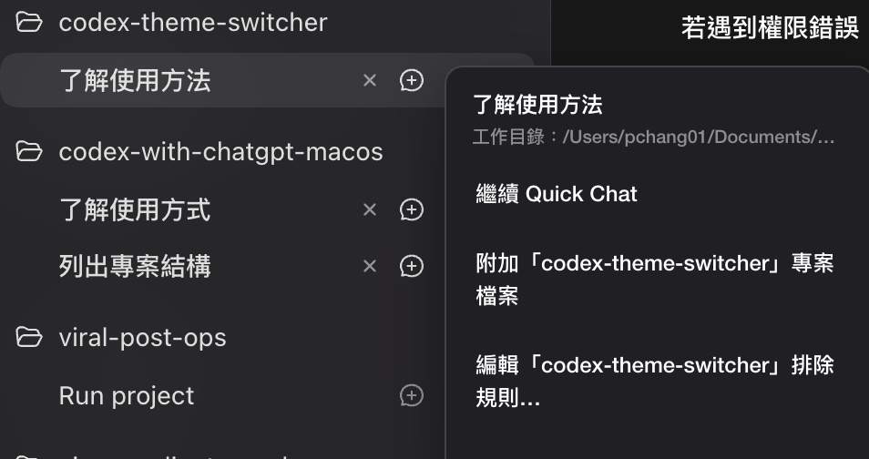

# Codex with ChatGPT · Swift for macOS

讓 Codex 與 ChatGPT Quick Chat 接得更順的 macOS App。

一般流程是先在 Quick Chat 討論，再按「新增至 Codex」執行；但 ChatGPT 與 Codex 是兩套不同的系統，之後要回到剛才的對話，通常得自己重新翻找。這個 App 會在每個 Codex session 旁加入操作按鈕，第一次按可開啟 Quick Chat，聊過後再按則會回到同一串對話。

需要讓 ChatGPT 看專案時，也能從同一入口附加該 session 工作目錄中的檔案。檔案太多會自動分批，敏感內容可透過 `.c2cignore` 排除。開啟 App 後即會自動注入；不使用這些按鈕時，原本的 Codex／ChatGPT 操作方式不受影響。

**macOS 13 以上，Apple Silicon / Intel。無 Node.js 或 npm。** App 與 CLI 都只在本機透過 CDP 操作桌面版介面，不會啟動 HTTP server、OAuth、MCP 或公開連線；Sparkle 2 負責已簽署 App 的自動更新。

## 下載與安裝

目前版本：**v0.1.2**

- [下載 Apple Silicon 版（M1／M2／M3／M4）](https://github.com/irons163/codex-with-chatgpt-macos/releases/download/v0.1.2/CodexWithChatGPT-0.1.2-apple-silicon.dmg)
- [下載 Intel 版](https://github.com/irons163/codex-with-chatgpt-macos/releases/download/v0.1.2/CodexWithChatGPT-0.1.2-intel.dmg)
- [查看最新版與更新紀錄](https://github.com/irons163/codex-with-chatgpt-macos/releases/latest)

開啟 DMG，將 `CodexWithChatGPT.app` 拖進 `/Applications`，再直接啟動即可。App 已經過 Developer ID 簽署與 Apple notarization，之後可透過內建的 Sparkle 檢查更新。

## 使用方式

1. 開啟 Codex，再啟動 `CodexWithChatGPT.app`。App 會常駐 menu bar 並自動加入 session 操作按鈕。
2. 按任一 Codex session 右側的圖示。
3. 從選單執行需要的操作：
   - **開啟／繼續 Quick Chat**：第一次會建立對話，之後再按會回到同一串對話。
   - **附加專案檔案**：把該 session 工作目錄中的程式碼與文字檔附加到 Quick Chat。
   - **編輯排除規則**：開啟該專案的 `.c2cignore`，調整不應附加的檔案。

Quick Chat 綁定後，可按 session 旁的「×」解除。檔案超過 20 個時會自動分批；送出目前訊息後，再按一次「附加專案檔案」即可載入下一批。

若按鈕沒有出現，可從 menu bar 選擇「重新注入」。

## 附件安全邊界

- 不啟動 HTTP server、OAuth、MCP、tunnel 或公開 listener。
- 只掃描所選工作目錄，工作區外檔案與 symlink 不會加入附件。
- `.c2cignore` 集中列出可查看、可修改的預設安全排除規則，並同時套用 `.gitignore`。
- 每批最多 20 個檔案與 8 MiB；單檔最多 1 MiB，且只接受可驗證的 UTF-8 文字檔。
- 附件是按下按鈕時的檔案內容，不會賦予 ChatGPT 持續讀取本機專案的權限。

附帶的 [操作 Skill](skill/SKILL.md) 提供 Swift/macOS 工作流程，尚未自動安裝至個人 Codex 設定。

## 授權

本專案採用 [MIT License](LICENSE)，且不是 OpenAI 官方產品。
